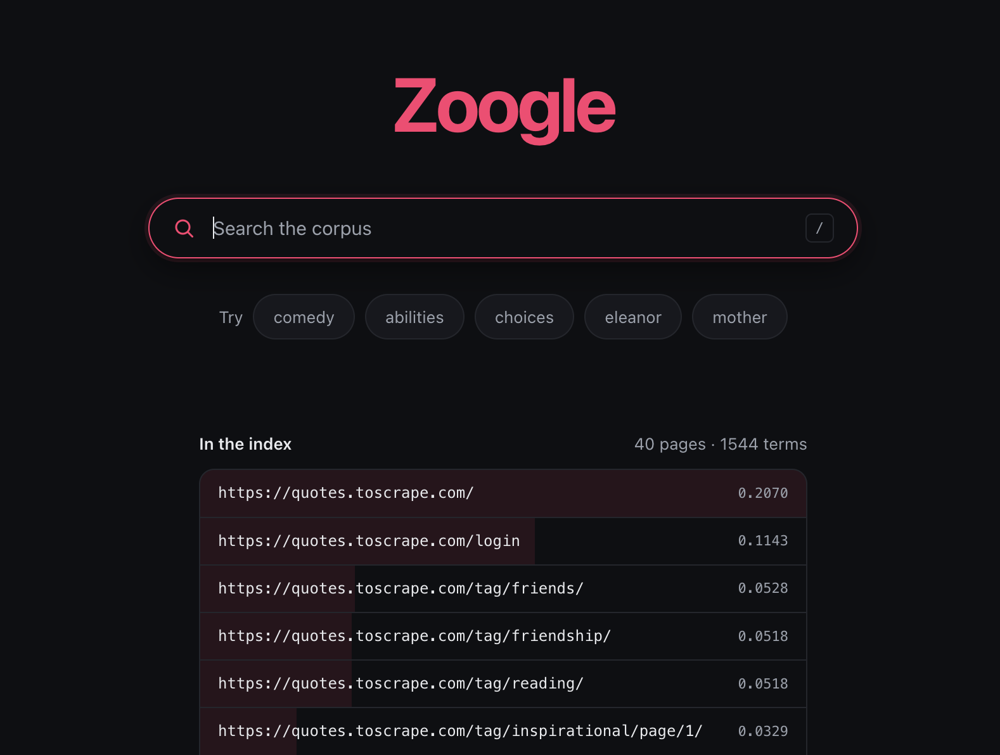

# Zoogle

A search engine built from scratch to figure out how Google actually works.

I wanted to understand the system design behind a search engine, so I built one
instead of just reading about it. Every part is written by hand: the crawler, the
parser, the index, the ranking, and the web UI. No search libraries.

The interesting part turned out to be the order things break in. You build the simple
version, run it on real data, watch it fail, and then the standard solution makes
sense because you've seen the problem it fixes. That happened a few times here and I
wrote it all down.

The whole thing comes from one constraint: you can't search the web while someone is
waiting. Reading the internet to answer one query would take hours. So the work has
to happen before the query shows up, and pretty much every design decision follows
from that.

Two longer docs if you want the details:

* [docs/CONCEPTS.md](docs/CONCEPTS.md) explains TF-IDF, BM25, and PageRank, why I
  switched from one to another halfway through, and what Google does that this
  doesn't.
* [docs/CODE.md](docs/CODE.md) walks through every file line by line.

## Screenshots



The home page, showing 40 pages crawled from quotes.toscrape.com. The suggestion chips
are pulled from the index, not hardcoded, so they change when you index something else.
The shading behind each row is that page's PageRank score. The homepage is highest at
0.2070. The `/login` page is second, not because anyone thinks it's important, but
because every page in the site navigation links to it.


Results for `abilities`, one of the suggestions from the home page. The pink chip under
the search box shows the normalized token that actually got searched, which isn't
always what you typed. The bold words are the matches, and the snippet around them is
picked by sliding a 30 word window over the page to find the densest patch. Scores on
the right combine BM25 relevance with PageRank.

All three results say "Quotes to Scrape" because that site uses the same `<title>` on
every page. That's real data being messy, and it's a decent example of why you can't
rank on titles alone. The URLs, snippets, and scores still tell them apart fine.

## What it does

* **Crawler** that downloads pages, follows links, respects `robots.txt`, and skips
  duplicates.
* **Parser** that turns HTML into a title, clean text, tokens, and outbound links.
* **Inverted index** mapping every word to the pages containing it, with counts.
* **Query processing** that normalizes your search the same way documents were
  normalized.
* **Retrieval** that finds candidate pages with a dictionary lookup.
* **Ranking** using BM25 for relevance and PageRank for authority, blended together.
* **Snippets** that quote the part of the page your search terms actually appear in.
* **Web UI** built with React, talking to a FastAPI backend.

## How it works

The pipeline splits into two halves that run at completely different times. Crawling,
parsing, and indexing happen offline and get repeated now and then. Query processing,
retrieval, and ranking happen online, on every request, and have to be fast.

```text
                      PAGES (web or local corpus)
                               │
                               ▼
                        ┌─────────────┐
                        │   Crawler   │   download pages, follow links
                        └──────┬──────┘
                               │  raw HTML
                               ▼
                        ┌─────────────┐
                        │   Parser    │   extract title, text, links
                        └──────┬──────┘
                               │  clean documents
                               ▼
                        ┌─────────────┐
                        │   Indexer   │   build the inverted index
                        └──────┬──────┘
                               │  index on disk
                               ▼
   ┌───────────────────────────────────────────────────────┐
   │                    QUERY TIME                           │
   │                                                         │
   │  User query ──►  Query Processor  (normalize, tokenize) │
   │                       │                                 │
   │                       ▼                                 │
   │                  Retrieval        (lookup in index)     │
   │                       │                                 │
   │                       ▼                                 │
   │                  Ranking          (BM25 + PageRank)     │
   │                       │                                 │
   │                       ▼                                 │
   │               Results + Snippets                        │
   └───────────────────────────────┬───────────────────────┘
                                    │
                                    ▼
                                  User
```

| Stage | What it does |
| --- | --- |
| Crawling | Download pages, follow links, respect `robots.txt`, avoid duplicates. |
| Parsing | Strip HTML down to structured data and normalize the text. |
| Indexing | Build the inverted index with term counts. |
| Query processing | Normalize the query exactly like the documents were normalized. |
| Retrieval | Look up query terms to gather candidate pages. |
| Ranking | Score candidates with BM25 and PageRank, best first. |
| Serving | Run the online path, build snippets, return JSON. |

### The inverted index

This is the data structure everything else is built around. Instead of storing pages
and their words, you store words and their pages:

```text
Documents:
  1: "cats are friendly"
  2: "dogs are friendly"
  3: "cats and dogs"

Inverted index:
  cats     → {1, 3}
  dogs     → {2, 3}
  friendly → {1, 2}
```

Searching for `cats` gives you `{1, 3}` immediately, without looking at a single
document.

## Design decisions

This is the part I actually cared about. Each one is a place where you have to pick
something, and knowing why makes the whole architecture click.

### Do the expensive work before anyone searches

A query needs to be answered in milliseconds, but understanding a corpus takes minutes.
So everything slow happens up front. Crawling, parsing, indexing, and PageRank all run
before a user shows up. A request just tokenizes a few words, reads a few dictionary
keys, and scores a small number of candidates.

That's why `server.py` computes PageRank and average document length at startup instead
of per request. Search isn't fast because the work is fast. It's fast because the work
already happened.

### Flip the data structure around

The obvious way to store things is page to words. But queries arrive as words, so you
want words to pages. Flipping it turns a search into a dictionary lookup instead of a
scan. The index ends up bigger than the pages it describes, which is a trade you make
on purpose.

### Use one function for documents and queries

If a page says `"Python!"` and you search for `python`, those only match if both sides
were processed identically. `query.py` is three lines that just call the parser's
`tokenize`, and that's the whole reason it exists. If the two ever drift apart,
searches quietly return nothing and there's no error telling you why.

### Keep retrieval cheap and ranking expensive

Good scoring is too slow to run on an entire corpus. So retrieval does the cheap part
first, using dictionary lookups to answer "which pages could possibly match". Ranking
then only scores those. On a real index this is the difference between looking at
billions of pages and looking at a few thousand.

### Score by rarity, not just how often a word shows up

A page with "the" 50 times isn't about "the". So each word gets weighted by how much it
narrows things down, which is what IDF does. A word appearing in every document counts
for nothing. I never wrote a stopword list. The math figures out which words are noise.

### Switch from TF-IDF to BM25 (after real data proved it was needed)

TF-IDF divides by the full length of a document, which assumes a page twice as long
needs twice the mentions to be equally relevant. That isn't how writing works.

I found out the hard way. On a 40 page crawl I searched for `einstein` and got three
tiny tag pages at the top. The actual Albert Einstein page came fourth. It mentioned
Einstein 12 times in 650 words, but a 53 word tag page mentioning him once beat it.

BM25 fixes this two ways. Term counts saturate, so the 20th mention adds almost nothing
over the 19th. And length normalization is partial and measured against the corpus
average instead of being absolute. The Einstein page went from 4th to 1st.

The frustrating part is that the bug was invisible before. My original test corpus was
six hand written pages, all between 77 and 108 words, so there was no length variation
for the flaw to show up in. A test corpus that's too tidy will hide your problems. Both
scorers are still in `ranking.py` so you can run them side by side.

### Add a signal that has nothing to do with the text

Reading the words on a page can't tell you if it's well researched or just uses the
right vocabulary. PageRank solves this by ignoring the text completely and looking only
at links. A page is important if important pages link to it. That was Google's original
insight and the reason it beat the keyword matchers of the 90s.

The clever bit is that a page's score gets divided among its links, not copied to each
one. Linking to 100 pages gives each of them a hundredth of your authority. You can't
create authority by linking to everything, you just water down what you have.

### Don't let one signal drown out the other

BM25 scores land around 0.5 to 2.0 and PageRank around 0.02 to 0.22, so adding them
directly lets the bigger numbers win by accident. Both get normalized to a 0 to 1 range
first, then averaged with relevance weighted higher (`AUTHORITY_WEIGHT = 0.2`).

Authority has no idea what you searched for, so it should only break ties between pages
that are already relevant. It's easy to get wrong. The crawl showed the homepage
picking up 8 times the average authority just for being the page everything links back
to, and at a weight of 0.2 that's enough for it to beat the actual Einstein page on a
search for `einstein`.

### Catch duplicates two different ways

The same page shows up under multiple names, and there are two separate problems here.

The first is URLs that are spelled differently but obviously identical.
`normalize_url()` strips fragments, lowercases the host, drops default ports, and
removes tracking parameters, so `https://x.com/a#top` and `HTTP://X.com:80/a` become
the same thing.

The second is harder. `/tag/love/` and `/tag/love/page/1/` are genuinely different URLs
serving identical content. No amount of URL cleanup will merge them, because only the
content shows they're the same. So the crawler also hashes the visible text and skips
anything it's already saved.

Leaving duplicates in costs you twice. They waste result slots, and they split a page's
PageRank across its two names so it ranks lower than one copy would have.

### Be polite when crawling

A crawler is a loop with no pause in it, pointed at someone else's server. So it honors
`robots.txt`, waits a second between requests to the same host, identifies itself
properly in the User-Agent, and caps how much it will fetch. None of that is enforced by
anything. Following it is just what makes crawling okay instead of rude.

For the things Google does that this doesn't (learned ranking, semantic matching,
sharding, personalization, spam fighting), see
[docs/CONCEPTS.md](docs/CONCEPTS.md#13-what-google-does-that-we-dont).

## Running it

```bash
# build an index from the six hand written pages
uv run python indexer.py

# or crawl a real site and index that instead
uv run python crawler.py https://quotes.toscrape.com --max-pages 40 --fresh
uv run python indexer.py crawled

# start the API on port 8000
uv run python server.py

# start the UI on port 5173, in another terminal
npm run dev --prefix frontend
```

Every module also runs on its own and prints what its stage does:

```bash
uv run python parser.py                 # parse one page
uv run python indexer.py                # build the index, show postings
uv run python retrieval.py              # candidates for a query
uv run python ranking.py einstein love  # TF-IDF vs BM25, side by side
uv run python pagerank.py               # link graph and authority scores
uv run python snippets.py               # snippets and highlighting
uv run python suggest.py                # suggested queries from the index
```

`ranking.py` takes queries as arguments, which is the quickest way to watch the two
scorers disagree.

## Project structure

```text
zoogle/
├── corpus/          six hand written pages, the starting dataset
├── crawled/         pages fetched by the crawler (gitignored)
├── docs/            CODE.md, CONCEPTS.md, screenshots
├── frontend/        React + Vite UI
├── crawler.py       fetch pages, follow links, save HTML
├── parser.py        HTML into title, text, tokens, links
├── indexer.py       build, save, and load the inverted index
├── query.py         normalize a query
├── retrieval.py     index lookup into candidate pages
├── ranking.py       BM25 and TF-IDF, blended with PageRank
├── pagerank.py      authority from the link graph
├── snippets.py      pick and highlight the excerpt
├── suggest.py       example queries pulled from the index
└── server.py        FastAPI JSON API
```

## Tech stack

* Python 3.12
* `beautifulsoup4` for HTML parsing, `requests` for crawling
* FastAPI and uvicorn for the API
* React and Vite for the frontend
* `uv` for Python dependencies

Everything else is standard library. Dependencies only got added where they clearly
earned their place.

## Roadmap

Built in data flow order, so every stage had real input to work against.

* [x] README and architecture
* [x] Local corpus of interlinked HTML pages
* [x] Parser
* [x] Indexer
* [x] Query and retrieval
* [x] Ranking with TF-IDF
* [x] PageRank
* [x] Snippets
* [x] Web UI
* [x] Crawler with `robots.txt` support
* [x] BM25 replacing TF-IDF
* [x] Query suggestions from the index
* [x] Tests
* [x] Clickable result links
* [ ] Pagination

## The core idea

The whole engine in a few lines:

```python
documents = {
    1: "Python is a programming language",
    2: "Java is used for backend development",
    3: "Python is useful for data science",
}

index = {}
for doc_id, text in documents.items():
    for word in text.lower().split():
        index.setdefault(word, set()).add(doc_id)

query = "python"
for doc_id in index.get(query, set()):
    print(documents[doc_id])
```

Crawling, BM25, PageRank, snippets, and the UI are all scaffolding around that one
idea. Precompute the map from words to pages, then answer every query by reading it.
